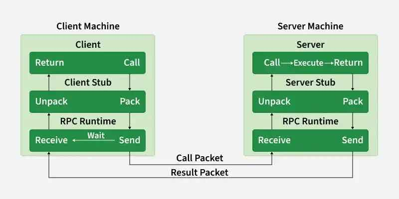

# RPC (Remote Procedure Call)

Make calling code on a remote machine feel like calling it local.

RPC handles everything (boilerplate) underneath.

(otherwise http JSON → call → parse response → handle errors)



---

## Notes

* stubs are auto generated code that performs plumbing code itself.

---

# gRPC are faster than REST & graphQL

## Why

### Protocol Buff (binary encoding)

* JSON → binary
* 1KB → 200 bytes

---

### HTTP/2

* rest runs on HTTP/1.1 (each req needs new connection)
* HTTP/2 supports streaming in both direction

---

## Protobufs (Protocol Buffers)

* google invented
* serialize to binary

---

## Steps

1. we just write a "proto" file that describe data structure/format
2. tools auto generate code in any language

---

## .proto file

```proto
message User {
  int32 id = 1;
  string name = 2;
}
```

1,2 are sent (in binary) not "name", "id" etc.

```proto
service UserService {
  rpc GetUser (UserRequest) returns (User);
  rpc ListUsers (Empty) returns (stream User)->streaming;
}
```


---

## Where it is used

* microservices (high internal calls)
* mobile clients (low battery, low network used)
* real-time streaming
* multi language systems
