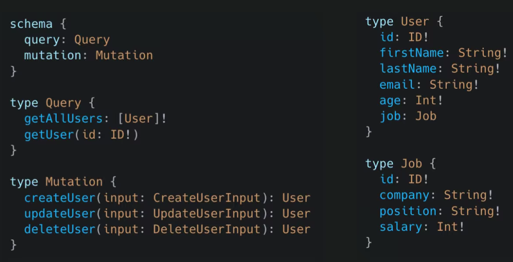

# GraphQL Notes


## Table of Contents

- [What is GraphQL?](#what-is-graphql)
- [GraphQL vs REST](#graphql-vs-rest)
- [Schema Development](#schema-development)
- [Querying and Mutating Data](#querying-and-mutating-data)
- [Developer Benefits](#developer-benefits)
- [Summary](#summary)

---

## What is GraphQL?

GraphQL is a **query language for APIs** that provides:

- A **type system** to describe your data schemas.
- The ability for front-end consumers to **request exactly the data they need** — no more, no less.


---

## GraphQL vs REST

| Feature | REST | GraphQL |
|---|---|---|
| Endpoints | Multiple URLs per resource | Single entry point |
| Data Fetching | Can lead to over-fetching or under-fetching | Returns exactly what was requested |
| Response Shape | Fixed by the server | Mirrors the structure of the query |

### Key Problems with REST

- **Under-fetching**: One endpoint doesn't return enough data, forcing multiple requests.
- **Over-fetching**: An endpoint returns more data than the client actually needs.

### How GraphQL Solves This

GraphQL uses a **single entry point** and returns data in a structure that **mirrors the request**, giving the client full control over the shape of the response.


---

## Schema Development

Developers define the API structure using a **schema**:

- Custom objects are defined using the `type` keyword.
- Each type has **specific fields** with defined data types.
- **Relationships between types** are also defined within the schema, enabling connected data fetching.

### Example

```graphql
type User {
  id: ID!
  name: String!
  email: String!
  posts: [Post]
}

type Post {
  id: ID!
  title: String!
  author: User
}
```


---

## Querying and Mutating Data

Every GraphQL API includes two core operation types:

### `query` — Reading Data

Used to **fetch** data from the API.

```graphql
query {
  user(id: "1") {
    name
    email
  }
}
```

### `mutation` — Modifying Data

Used to **create, update, or delete** data.

```graphql
mutation {
  createUser(name: "Alice", email: "alice@example.com") {
    id
    name
  }
}
```


---

## Developer Benefits

Because the schema is explicitly defined upfront:

- **Tooling can provide autocompletion** for writing queries (e.g., in GraphiQL, Insomnia, Postman).
- The API is **self-documenting** — developers can explore available types and fields directly.
- It's easier to **discover and consume** the API without extensive external documentation.


---

## Summary

| Concept | Key Takeaway |
|---|---|
| **Definition** | A query language + type system for APIs |
| **vs REST** | Single endpoint, no over/under-fetching |
| **Schema** | Defined with `type` keyword; fields and relationships declared |
| **Query** | Used for reading data |
| **Mutation** | Used for writing/modifying data |
| **Tooling** | Schema enables autocompletion and API exploration |

---

*Notes taken from a GraphQL introductory video.*
