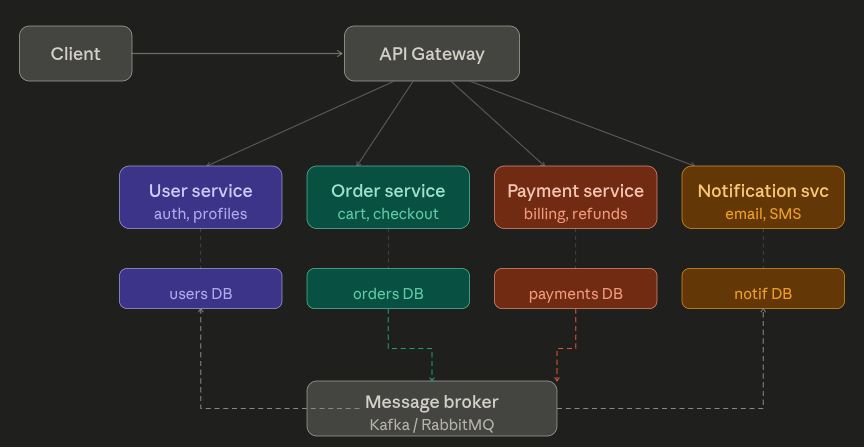

# Microservices Architecture — How Systems Communicate

---

## 📌 What Problem Are We Solving?

- A **monolith** is one giant codebase — one process, one database, deployed as a single unit
- Works fine when small, but as the app grows:
  - A bug in the payments module can **crash the entire app**
  - Deploying a change to one feature **requires redeploying everything**
  - Multiple teams can't work independently without constantly blocking each other

**Microservices** is the solution:

> Split the system into small, independent services — each owning one responsibility, deployed separately, communicating over a network.

---

## 🗺️ The Big Picture

A typical microservices system looks like this:



- Each box is a **separate deployable service** with its own database, codebase, and team
- Services talk to each other either **directly** (sync) or **via a message broker** (async)
- The **API Gateway** is the single entry point — it routes requests to the right service

---

## ⚡ The Two Fundamental Communication Styles

Every service-to-service call is either **synchronous** or **asynchronous**. Choosing between them is one of the most important architectural decisions you'll make.

---

### 1. Synchronous Communication

- Service A sends a request and **blocks** — it waits and does nothing until Service B responds
- Like a **phone call** — both parties must be available at the same time

```js
// Order service calls User service
const user = await fetch('http://user-service/users/42');
const data = await user.json();
// Only continues AFTER the response arrives
```

**✅ Good for:**
- Queries needing an immediate answer
- Example: "Is this user verified?" — you must know before continuing

**❌ Risk:**
- If User service is **down or slow**, Order service is also affected
- Creates **tight coupling** and potential cascading failures

---

### 2. Asynchronous Communication

- Service A **publishes an event** to a message broker and immediately moves on
- Other services subscribe and react in their own time
- Like a **text message** — you send it and continue with your day

```js
// Order service publishes an event — no waiting
await kafka.send({
  topic: 'order.placed',
  messages: [{ value: JSON.stringify({ orderId: '99', userId: '42' }) }]
});
// Immediately continues — done!
```

**✅ Good for:**
- Work that doesn't need an immediate reply
- Example: "Order placed → send email, update inventory, charge card" — all can happen independently

**✅ Key benefit:**
- If Notification service is down, events **queue up** and process when it recovers — no cascading failures

**⚠️ Tradeoff:**
- Harder to debug
- Order of events not guaranteed
- **Eventually consistent**, not immediately consistent

---

## 🔄 One Publish → Many Consumers (Fan-out)

A major async superpower — publish one event, multiple services react independently:

```
Order service  →  publishes "order.placed"  →  broker
                                                  ├── Notification svc  (sends confirmation email)
                                                  ├── Inventory svc     (reserves stock)
                                                  └── Payment svc       (initiates charge)
```

- Order service knows **nothing** about any of these consumers
- Add a new consumer (e.g. Analytics) without touching Order service at all

---

## 🧩 The 4 Communication Patterns You'll Actually Encounter

---

### Pattern 1 — REST over HTTP `[Sync]`

- The **most common** pattern in microservices
- Services call each other just like they call any external API — HTTP verbs, JSON body, status codes

```
GET    /users/42
POST   /orders  { userId, items }
DELETE /sessions/abc
```

| | |
|---|---|
| ✅ Simple | Everyone knows HTTP |
| ✅ Easy to test | Works with curl / Postman |
| ❌ Slower | Not ideal for high-throughput internal calls |
| ❌ No schema enforcement | JSON can drift without you noticing |

---

### Pattern 2 — gRPC `[Sync]`

- Google's protocol — you define a contract in a `.proto` file, and **code is auto-generated**
- Uses **binary encoding over HTTP/2** — roughly 10x faster than REST for internal calls

```protobuf
// user.proto
service UserService {
  rpc GetUser(UserRequest) returns (UserResponse);
}
```

| | |
|---|---|
| ✅ Very fast | Binary + HTTP/2 |
| ✅ Schema = contract | Can't drift accidentally |
| ❌ More setup | Proto files to manage across services |
| ❌ Harder to debug | Binary format — can't just read it like JSON |

**Best for:** High-throughput internal service-to-service calls where performance matters.

---

### Pattern 3 — Message Queue `[Async]`

- **One producer, one consumer**
- Like a task queue — jobs pile up and a worker processes them one at a time
- Tools: **RabbitMQ**, Amazon SQS

```
Producer  →  [queue]  →  1 Consumer

// Producer side
channel.sendToQueue('resize-image',
  Buffer.from(JSON.stringify({ url }))
);
```

| | |
|---|---|
| ✅ Decoupled | Producer doesn't wait for consumer |
| ✅ Durable | Messages survive restarts, retries built in |
| ❌ 1-to-1 only | Each message is processed by only one consumer |

**Best for:** Background jobs — image resizing, report generation, sending emails one at a time.

---

### Pattern 4 — Pub / Sub (Event-Driven) `[Async]`

- **One publisher, many subscribers**
- The publisher doesn't know who is listening — complete loose coupling
- Tools: **Apache Kafka**, Amazon SNS

```
Publisher  →  "order.placed"  →  broker
                                    ├── Notification svc  ✅ subscribed
                                    ├── Inventory svc     ✅ subscribed
                                    └── Analytics svc     ✅ subscribed
```

| | |
|---|---|
| ✅ Zero coupling | Publisher is completely oblivious to consumers |
| ✅ Infinitely extensible | Add new consumers with zero code changes to the publisher |
| ❌ Eventual consistency | Data won't be in sync immediately everywhere |
| ❌ Harder to trace | A single action fans out across many services |

**Best for:** Anything where one event should trigger multiple independent reactions.

---

## 🧠 Quick Reference — When to Use What

| Pattern | Style | Use When |
|---|---|---|
| REST | Sync | You need an immediate answer. Simple internal calls. |
| gRPC | Sync | High-frequency internal calls where speed matters. |
| Message Queue | Async | One service does one background job per message. |
| Pub / Sub | Async | One event should trigger multiple independent services. |

---

## ⚠️ Key Gotchas to Remember

- **Cascading failures** — in sync communication, if one service is slow, the caller is slow too. Use timeouts and circuit breakers.
- **Idempotency** — async messages can be delivered more than once. Your consumer must handle duplicates safely.
- **Event ordering** — async brokers don't always guarantee order. Never assume a `payment.charged` arrives after `order.placed`.
- **Database per service** — each service owns its own DB. Never share a database between two services — this recreates the tight coupling you were trying to escape.
- **Observability** — with many services, you need distributed tracing (e.g. Jaeger, OpenTelemetry) or debugging becomes a nightmare.

---
