# Quartz – Job Scheduler

Quartz is an open source job scheduling library for Java that lets you automate tasks, either one-time or recurring.

## Core Concepts

**Jobs**  
  Jobs are any Java class you want to run, giving total flexibility.

**Triggers**  
  Triggers define when the job runs (simple time, cron/interval).

**Job Stores**  
  Job stores handle persistence:
  - Stored in DB or JDBC JobStore  
  - Survives restarts  

## Features

### Clustering
Run Quartz on multiple servers  
Load balancing  
No scheduled job is missed  

### Transaction Support
Jobs participate in JTA (Java distributed transactions)  
Ensures atomicity  

### Listeners & Plugins
Extend Quartz’s behaviour  

### Flexible Deployment
Can be embedded in your application or run standalone  
Can run inside an application server  

## Relation with Operating System

Concepts involved: process/thread, scheduling, concurrency, synchronization  

### Threads & Thread Pool
Quartz maintains a worker thread pool for executing jobs

## Quartz – OS Concepts Map

